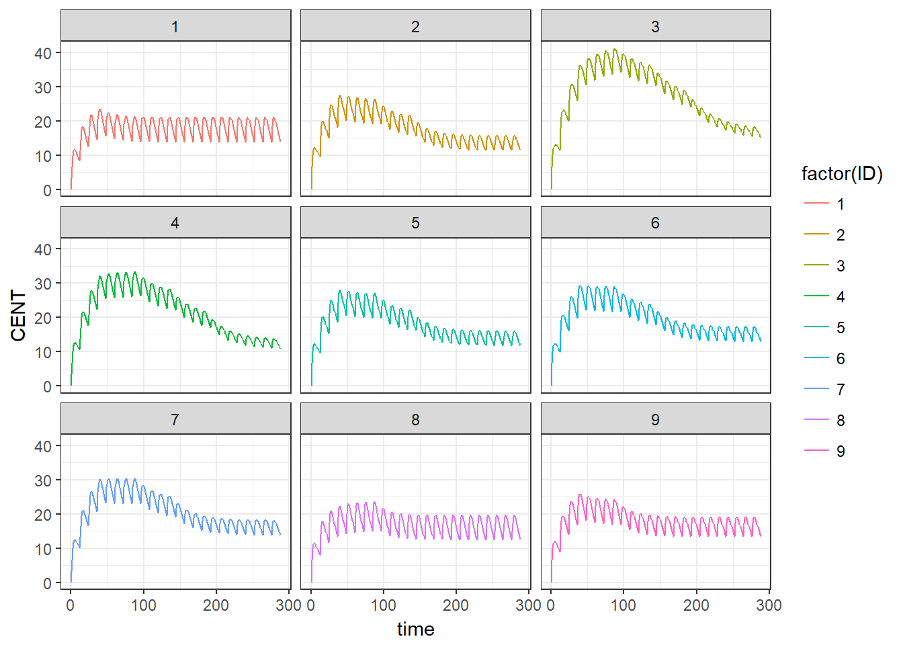

# Titration Example


```r
library(mrgsolve)
#> Loading required package: methods
library(tidyverse, warn.conflicts = FALSE)
#> Loading tidyverse: ggplot2
#> Loading tidyverse: tibble
#> Loading tidyverse: tidyr
#> Loading tidyverse: readr
#> Loading tidyverse: purrr
#> Loading tidyverse: dplyr
#> Conflicts with tidy packages ----------------------------------------------
#> filter(): dplyr, stats
#> lag():    dplyr, stats
```

Can interactively develop the cpp functions for the needed functionality
and check they work as expected.


```r
require(Rcpp)
#> Loading required package: Rcpp

cppFunction("
            bool within(Rcpp::NumericVector x, double val) {
   int n = x.size();
   for (int i = 0; i < n; ++i) {
      if (x[i] == val) {
        return true;
      }
   }
   return false;
}
            ")

within(c(1, 4, 6), 4)
#> [1] TRUE
within(c(1, 4, 6), 5)
#> [1] FALSE
cppFunction("
double titrateDose(NumericVector possibleDoses, double currentDose, bool up){
  if (up) {
    possibleDoses = possibleDoses[possibleDoses >= currentDose];
    if (possibleDoses.size() > 1) {
      return possibleDoses[1]; // 2nd element - one dose higher
    }
    // at max dose since only one dose remaining that is >= so keep the same
    return possibleDoses[0]; 
  } else {
    possibleDoses = possibleDoses[possibleDoses <= currentDose];
    if (possibleDoses.size() > 1) {
          return possibleDoses[possibleDoses.size()-2]; // 2nd to last element - one dose lower
        } 
        // at min dose since only one dose remaining that is <= so keep the same
        return possibleDoses[0];
      }
}")
titrateDose(1:5, 3, up = TRUE)
#> [1] 4
titrateDose(1:5, 3, up = FALSE)
#> [1] 2
```


```r
mod1 <- mread_cache(model = "titration") 
#> Compiling titration ...
#> done.
```


```r
see(mod1)
#> 
#> Model file:  titration.cpp 
#>  $PARAM TVCL = 1.3, TVVC=28, TVKA=0.6, WT=70, START_DOSE = 15
#>  
#>  $SET delta= 1
#>  
#>  $CMT GUT CENT
#>  
#>  $PLUGIN Rcpp mrgx
#>  
#>  $GLOBAL
#>  using namespace Rcpp;
#>  NumericVector possibleDoses;
#>  NumericVector VISITT;
#>  
#>  bool within(Rcpp::NumericVector x, double val) {
#>     int n = x.size();
#>     for (int i = 0; i < n; ++i) {
#>        if (x[i] == val) {
#>          return true;
#>        }
#>     }
#>     return false;
#>  }
#>  double titrateDose(Rcpp::NumericVector possibleDoses, double currentDose, bool up){
#>    if (up) {
#>      possibleDoses = possibleDoses[possibleDoses >= currentDose];
#>      if (possibleDoses.size() > 1) {
#>        return possibleDoses[1]; // 2nd element - one dose higher
#>      }
#>      return possibleDoses[0]; // at max dose since only one dose remaining that is >= so keep the same
#>    } else {
#>      possibleDoses = possibleDoses[possibleDoses <= currentDose];
#>      if (possibleDoses.size() > 1) {
#>            return possibleDoses[possibleDoses.size()-2]; // 2nd to last element - one dose lower
#>          }
#>          return possibleDoses[0]; // at min dose since only one dose remaining that is <= so keep the same
#>    }
#>  }
#>  
#>  $PREAMBLE
#>  possibleDoses = mrgx::get<Rcpp::NumericVector>("possibleDoses");
#>  VISITT = mrgx::get<Rcpp::NumericVector>("VISITT");
#>  
#>  $MAIN
#>  if (NEWIND <= 1) {
#>    // titration dose to start on, right now not explicitly checking
#>    // if in possible doses, probably should do that
#>    F_GUT = START_DOSE;
#>  }
#>  if (within(VISITT, TIME)) {
#>    // only adjust dose on EVID == 1 or also during observation time can trigger a dose
#>    // adjustment if both dosing and observing at the same time and not
#>    // also checking EVID == 1
#>    if (CENT < 10 && EVID == 1) {
#>      F_GUT = titrateDose(possibleDoses, F_GUT, true);
#>    }
#>    if (CENT > 15 && EVID == 1) {
#>      F_GUT = titrateDose(possibleDoses, F_GUT, false);
#>    }
#>  }
#>  double CLi = exp(log(TVCL) + 0.75*log(WT/70) + ETA(1));
#>  double VCi = exp(log(TVVC) + ETA(2));
#>  double KAi = exp(log(TVKA) + ETA(3));
#>  
#>  $OMEGA name="IIV"
#>  0.1 0 0
#>  
#>  $ODE
#>  dxdt_GUT = -KAi*GUT;
#>  dxdt_CENT = KAi*GUT - (CLi/VCi)*CENT;
#>  
#>  $TABLE
#>  double CP = CENT/VCi;
#>  double ETA1 = ETA(1);
#>  double ETA2 = ETA(2);
#>  
#>  $CAPTURE ETA(1) ETA(2) F_GUT
```


```r
possibleDoses <- c(5, 7.5, 10.0, 12.5, 15, 17.5, 20, 30)
# times to check and titrate dose accordingly
VISITT <- seq(48,300, 48)
out <- mod1 %>%
  data_set(realize_addl(ev(ID=1:9, amt=1, ii=12, addl=24))) %>%
  env_update(possibleDoses = possibleDoses, VISITT = VISITT) %>%
  mrgsim(end=12*24) %>%
  as_data_frame()
```


```r
out %>%
ggplot(aes(time, CENT, group=ID, color = factor(ID)))+
geom_line() +
facet_wrap(~ID) + theme_bw()
```



Conclusion - starting dose too high, and algorithm not aggressive enough to titrate
down.


```r
distinct_doses <- out %>% distinct(ID, F_GUT, .keep_all = TRUE) %>% select(ID, time, F_GUT)
head(distinct_doses, n = 10)
#> # A tibble: 10 x 3
#>      ID  time F_GUT
#>   <dbl> <dbl> <dbl>
#> 1     1     0  15.0
#> 2     1    48  12.5
#> 3     2     0  15.0
#> 4     2    48  12.5
#> 5     2    96  10.0
#> 6     2   144   7.5
#> # ... with 4 more rows
```


```r
# time at which stabilized (final dose first seen)
distinct_doses %>% arrange(ID, desc(time)) %>%
  distinct(ID, .keep_all = T)
#> # A tibble: 9 x 3
#>      ID  time F_GUT
#>   <dbl> <dbl> <dbl>
#> 1     1    48  12.5
#> 2     2   144   7.5
#> 3     3   192   5.0
#> 4     4   192   5.0
#> 5     5   144   7.5
#> 6     6   144   7.5
#> # ... with 3 more rows
```


```r
devtools::session_info()
#> Session info -------------------------------------------------------------
#>  setting  value                       
#>  version  R version 3.4.0 (2017-04-21)
#>  system   x86_64, mingw32             
#>  ui       RTerm                       
#>  language (EN)                        
#>  collate  English_United States.1252  
#>  tz       America/New_York            
#>  date     2017-06-18
#> Packages -----------------------------------------------------------------
#>  package       * version     date       source                            
#>  assertthat      0.2.0       2017-04-11 CRAN (R 3.4.0)                    
#>  backports       1.1.0       2017-05-22 CRAN (R 3.4.0)                    
#>  base          * 3.4.0       2017-04-21 local                             
#>  bookdown        0.4         2017-05-20 CRAN (R 3.4.0)                    
#>  broom           0.4.2       2017-02-13 CRAN (R 3.4.0)                    
#>  cellranger      1.1.0       2016-07-27 CRAN (R 3.4.0)                    
#>  colorspace      1.3-2       2016-12-14 CRAN (R 3.4.0)                    
#>  compiler        3.4.0       2017-04-21 local                             
#>  datasets      * 3.4.0       2017-04-21 local                             
#>  devtools        1.13.2      2017-06-02 CRAN (R 3.4.0)                    
#>  digest          0.6.12      2017-01-27 CRAN (R 3.4.0)                    
#>  dplyr         * 0.7.0       2017-06-09 CRAN (R 3.4.0)                    
#>  evaluate        0.10        2016-10-11 CRAN (R 3.4.0)                    
#>  forcats         0.2.0       2017-01-23 CRAN (R 3.4.0)                    
#>  foreign         0.8-67      2016-09-13 CRAN (R 3.4.0)                    
#>  ggplot2       * 2.2.1       2016-12-30 CRAN (R 3.4.0)                    
#>  glue            1.1.0       2017-06-13 CRAN (R 3.4.0)                    
#>  graphics      * 3.4.0       2017-04-21 local                             
#>  grDevices     * 3.4.0       2017-04-21 local                             
#>  grid            3.4.0       2017-04-21 local                             
#>  gtable          0.2.0       2016-02-26 CRAN (R 3.4.0)                    
#>  haven           1.0.0       2016-09-23 CRAN (R 3.4.0)                    
#>  hms             0.3         2016-11-22 CRAN (R 3.4.0)                    
#>  htmltools       0.3.6       2017-04-28 CRAN (R 3.4.0)                    
#>  httr            1.2.1       2016-07-03 CRAN (R 3.4.0)                    
#>  jsonlite        1.5         2017-06-01 CRAN (R 3.4.0)                    
#>  knitr           1.16        2017-05-18 CRAN (R 3.4.0)                    
#>  lattice         0.20-35     2017-03-25 CRAN (R 3.4.0)                    
#>  lazyeval        0.2.0       2016-06-12 CRAN (R 3.4.0)                    
#>  lubridate       1.6.0       2016-09-13 CRAN (R 3.4.0)                    
#>  magrittr        1.5         2014-11-22 CRAN (R 3.4.0)                    
#>  memoise         1.1.0       2017-04-21 CRAN (R 3.4.0)                    
#>  methods       * 3.4.0       2017-04-21 local                             
#>  mnormt          1.5-5       2016-10-15 CRAN (R 3.4.0)                    
#>  modelr          0.1.0       2016-08-31 CRAN (R 3.4.0)                    
#>  mrgsolve      * 0.8.6       2017-03-16 CRAN (R 3.4.0)                    
#>  munsell         0.4.3       2016-02-13 CRAN (R 3.4.0)                    
#>  nlme            3.1-131     2017-02-06 CRAN (R 3.4.0)                    
#>  parallel        3.4.0       2017-04-21 local                             
#>  plyr            1.8.4       2016-06-08 CRAN (R 3.4.0)                    
#>  psych           1.7.5       2017-05-03 CRAN (R 3.4.0)                    
#>  purrr         * 0.2.2.2     2017-05-11 CRAN (R 3.4.0)                    
#>  R6              2.2.1       2017-05-10 CRAN (R 3.4.0)                    
#>  Rcpp          * 0.12.11     2017-05-22 CRAN (R 3.4.0)                    
#>  RcppArmadillo   0.7.900.2.0 2017-06-04 CRAN (R 3.4.0)                    
#>  readr         * 1.1.1       2017-05-16 CRAN (R 3.4.0)                    
#>  readxl          1.0.0       2017-04-18 CRAN (R 3.4.0)                    
#>  reshape2        1.4.2       2016-10-22 CRAN (R 3.4.0)                    
#>  rlang           0.1.1       2017-05-18 CRAN (R 3.4.0)                    
#>  rmarkdown       1.6         2017-06-17 Github (rstudio/rmarkdown@ca634d7)
#>  rprojroot       1.2         2017-01-16 CRAN (R 3.4.0)                    
#>  rvest           0.3.2       2016-06-17 CRAN (R 3.4.0)                    
#>  scales          0.4.1       2016-11-09 CRAN (R 3.4.0)                    
#>  stats         * 3.4.0       2017-04-21 local                             
#>  stringi         1.1.5       2017-04-07 CRAN (R 3.4.0)                    
#>  stringr         1.2.0       2017-02-18 CRAN (R 3.4.0)                    
#>  tibble        * 1.3.3       2017-05-28 CRAN (R 3.4.0)                    
#>  tidyr         * 0.6.3       2017-05-15 CRAN (R 3.4.0)                    
#>  tidyverse     * 1.1.1       2017-01-27 CRAN (R 3.4.0)                    
#>  tools           3.4.0       2017-04-21 local                             
#>  utils         * 3.4.0       2017-04-21 local                             
#>  withr           1.0.2       2016-06-20 CRAN (R 3.4.0)                    
#>  xml2            1.1.1       2017-01-24 CRAN (R 3.4.0)                    
#>  yaml            2.1.14      2016-11-12 CRAN (R 3.4.0)
```

